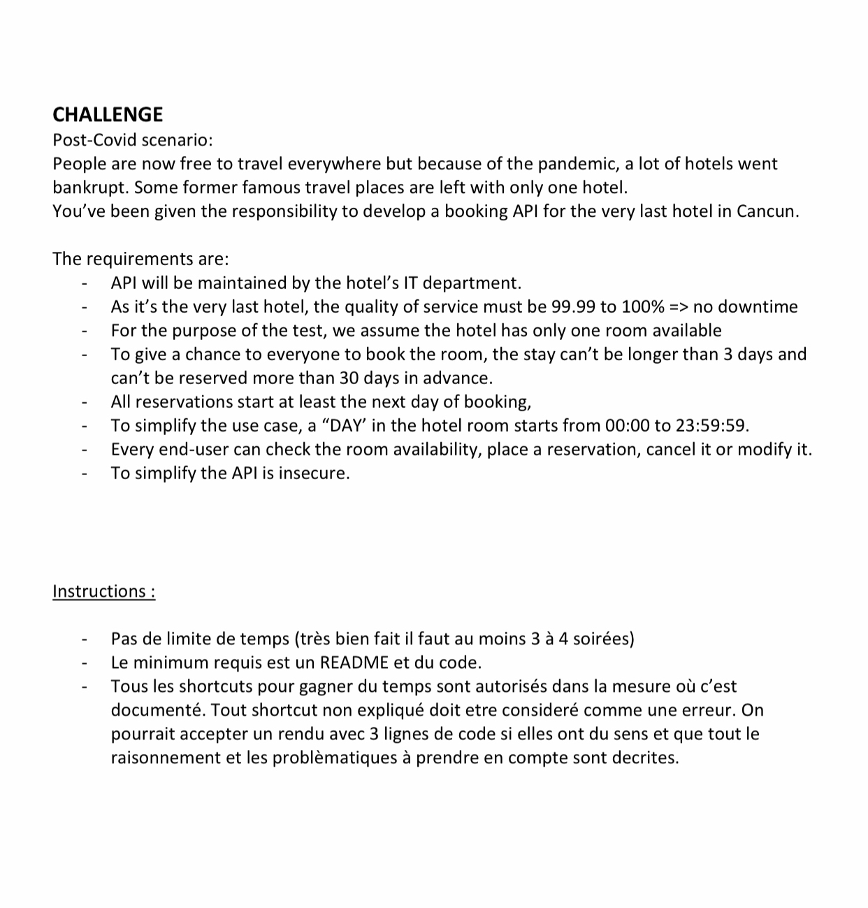

### <CENTER>BOOKING API</CENTER>

<p align="center">
   
</p>


### STACK

```
- Java 11
- Spring v2.5.4 
- H2 v1.4.200
- Lombok v1.18.24
- MapStruct 1.4.2.Final
```

### ENDPOINTS

- Server Port: 8080

### CREATE A BOOKING - /booking/v1/create - POST

- REQUEST

```json
{
	"id": 1,
	"start_date": "2022-07-01",
	"end_date": "2022-09-28"
}
```

- RESPONSE

```json
- http-status-code 200
{
	"id": 1,
	"start_date": "2022-07-01",
	"end_date": "2022-09-28"
}
```

### SEARCH A BOOKING - /booking/v1/search - GET
- RESPONSE

```json
- http-status-code 200
{
	"id": 1,
	"start_date": "2022-07-01",
	"end_date": "2022-09-28"
}
```
### UPDATE A BOOKING - /booking/v1/update - PATCH
- REQUEST

```json
{
	"id": 1,
	"start_date": "2022-07-01",
	"end_date": "2022-09-28"
}
```

- RESPONSE

```json
- http-status-code 200
{
	"id": 1,
	"start_date": "2022-07-01",
	"end_date": "2022-09-28"
}
```

### DELETE A BOOKING - /booking/v1/delete/{id} - DELETE
- RESPONSE

```json
- http-status-code 200
- message: Booking deleted!
```
